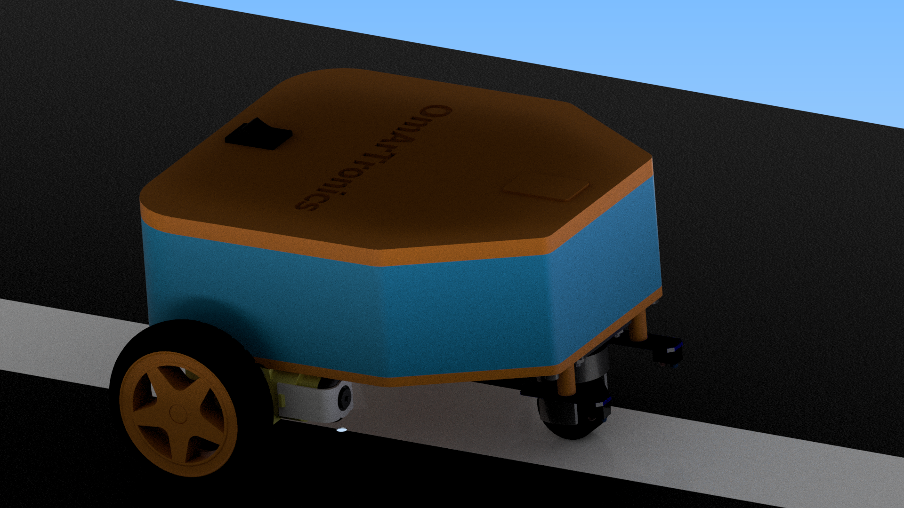
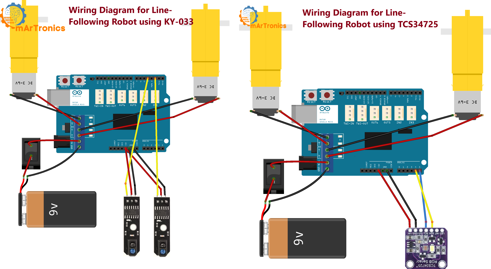

# Line Following Robot with Arduino: KY-033 and TCS34725 Sensors

This repository contains the code, resources, and documentation required to build a line-following robot using Arduino. The project includes two sensor approaches: the KY-033 IR sensor for detecting lines based on infrared light and the TCS34725 RGB sensor for advanced color-based line detection with PID control.

## Features
- **Two Sensor Approaches:**
  - KY-033 IR sensors for simple line detection.
  - TCS34725 RGB sensor for precise line detection with PID-based speed adjustment.
- Dynamic motor speed control for smooth and accurate path-following.
- Support for curved and complex tracks.

## Components
- **Electronics:**
  - Arduino Uno
  - Arduino Motor Shield Rev3
  - KY-033 Line Tracking Sensors (x2)
  - TCS34725 RGB Light Sensor
- **Motors and Wheels:**
  - 2 DC motors with gearboxes
  - 2 wheels and 1 support wheel
- **Accessories:**
  - Jumper wires, screws, a 9V battery, and a switch
- **3D-Printed Parts:**
  - Chassis
  - Sensor holders
  - Arduino mount

## Code
- For the **KY-033 Approach**, the code is available under `Arduino_Path_Following_Robot_KY-033.ino`.
- For the **TCS34725 Approach**, the code is available under `Arduino_Path_Following_Robot_TCS34725.ino`.

## How to Use
### 1. Build the Robot:
- Assemble the chassis and mount the motors, sensors, and Arduino as described in the project documentation.

### 2. Load the Code:
- Choose the desired sensor approach and upload the corresponding Arduino code.

### 3. Calibrate the Sensors:
- For the TCS34725 sensor, perform the calibration process to measure black and white values and calculate the middle threshold.

### 4. Test and Adjust:
- Place the robot on the track, adjust the PID parameters if necessary, and observe its behavior.

## Preview
### Robot Design:

### Wiring Diagram:
The wiring diagram includes connections for both sensor approaches.

*Both setups are available for reference in the repository.*

## Resources
- **Blog Post 1:** [Building a Line Following Robot with KY-033 Sensors](https://omartronics.com/building-a-line-following-robot-from-3d-design-to-implementation-with-ky-033-and-tcs34725-sensors/)
- **Blog Post 2:** [Building a Line Following Robot with TCS34725 RGB Sensor](https://omartronics.com/building-a-line-following-robot-with-tcs34725-rgb-sensor/)
- **YouTube Video KY-033:** [Step-by-Step Tutorial](https://youtu.be/bwaEEXmUkrw)
- **YouTube Video TCS34725:** [Step-by-Step Tutorial](https://youtu.be/rQcefOthMaI?si=7e3bOTNn8xU_p1Sb)
- **STL Files:** [3D Printable Files](https://cults3d.com/:2553986)

Enjoy building and exploring robotics with this hands-on project!
